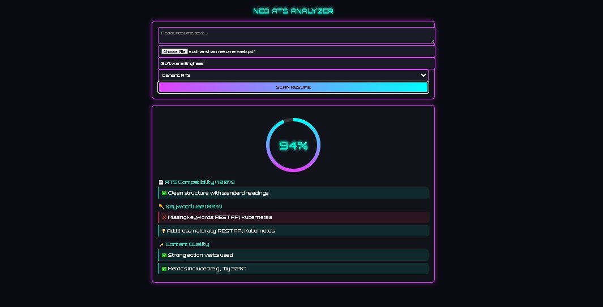

# 🧠 Resume Analyzer using Django

A privacy-first, full-stack web app that intelligently analyzes resumes using NLP and machine learning. Built with Django and designed for secure, local deployment—perfect for HR teams, recruiters, and internal hiring tools.

🖼️ Screenshots
  

## 🚀 Features

- 🔍 **Resume Parsing**: Extracts key details like name, skills, experience, and education using NLP.
- 🧠 **Skill Matching**: Compares candidate skills against job requirements.
- 📊 **Dashboard**: Admin-managed interface to view, filter, and evaluate resumes.
- 🛡️ **Privacy-First Design**: No external API calls—everything runs locally.
- 🧰 **Modular Architecture**: Easily extendable for new ML models or scoring logic.

---

## 🛠️ Tech Stack

| Layer         | Tools & Frameworks                          |
|--------------|---------------------------------------------|
| Backend       | Django, SQLite                              |
| Frontend      | HTML, CSS, Bootstrap                        |
| ML/NLP        | spaCy, scikit-learn, pandas                 |
| Deployment    | Localhost / Internal server (no cloud req.) |

---

## 📦 Setup Instructions

```bash
# Clone the repo
git clone https://github.com/sudharshan59/resume-analyzer-using-django.git
cd resume-analyzer-using-django

# Create virtual environment
python -m venv venv
source venv/Scripts/activate  # or venv/bin/activate on Linux/Mac

# Install dependencies
pip install -r requirements.txt

# Run the server
python manage.py runserver
📁 Folder Structure
Code
resume_analyzer/
├── resume_analyzer/       # Django project settings
├── resume_evaluator/      # Core app: resume parsing & scoring
├── templates/             # HTML templates
├── static/                # CSS, JS, assets
├── requirements.txt       # Dependencies
└── db.sqlite3             # Local database
🧪 Sample Use Case
Upload a resume → NLP extracts skills → ML model scores fit → Admin dashboard shows match percentage.

💡 Future Enhancements
🔐 Role-based access for HR teams

📤 Export results to CSV/PDF

🧬 Integrate with job boards or ATS

📈 Add SHAP-based explainability for scoring


👤 Author
Sudharshanmonith Modular ML builder | Privacy-first systems architect | Django dashboard designer Made with ❤️ by Sudharshan

📄 License
MIT License. See LICENSE file for details.
